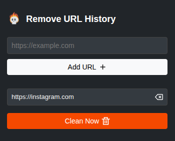

# URL History Cleaner

## Description
Stores URLs and deletes history only for those URLs and their endpoints.

## Installation
1. Open Chrome and navigate to `chrome://extensions/`.
2. Enable "Developer mode" using the toggle switch in the top right corner.
3. Click on the "Load unpacked" button and select the directory containing the extension files.

## Usage
1. Click on the extension icon in the Chrome toolbar.
2. Add URLs to the list by typing them into the input field and clicking the "Add URL" button.
3. Click the "Clean Now" button to delete history for the added URLs.

## Permissions
- `history`: Required to access and modify browser history.
- `storage`: Required to store URLs in local storage.

## Screenshot
